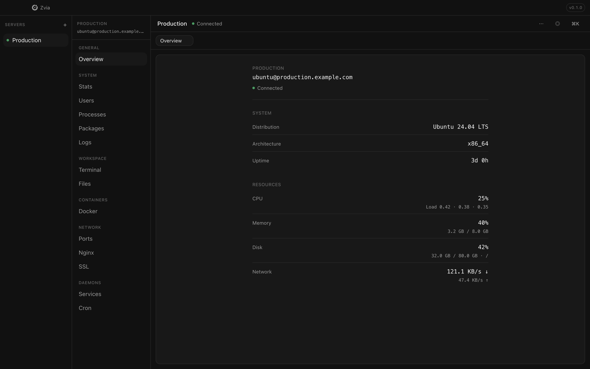
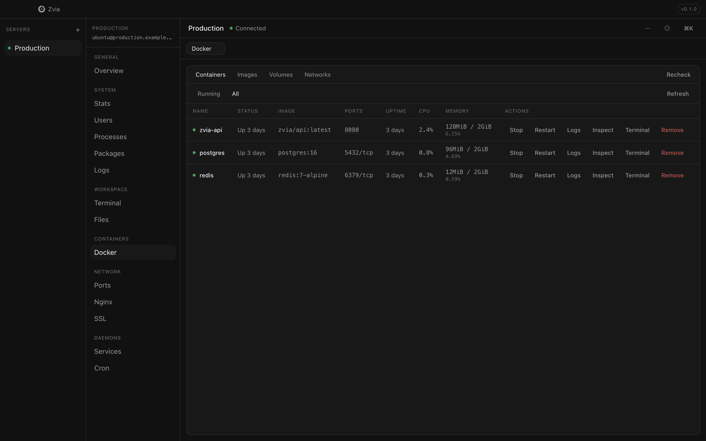
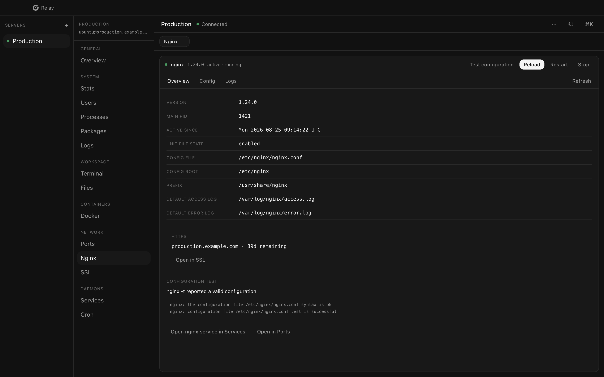
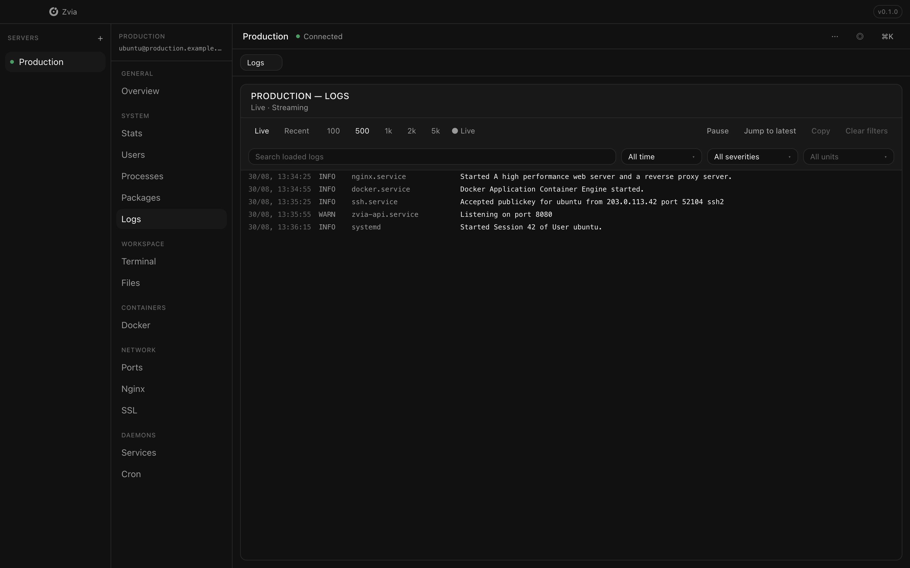
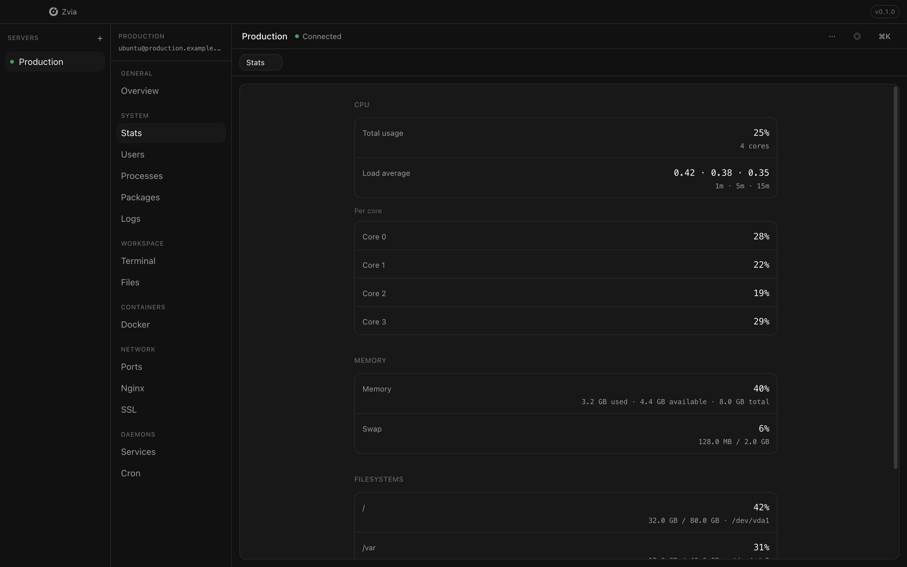

<p align="center">
  
</p>

<h1 align="center">Zvia</h1>

<p align="center">
  A native SSH workspace for your Linux servers.
</p>

<p align="center">
  Connect over SSH and manage VPS and bare-metal servers from one calm, server-scoped desktop app — stats, logs, Docker, Nginx, SSL, systemd, files, and a full terminal.
</p>

<p align="center">
  <a href="https://github.com/illia-co/zvia/actions/workflows/ci.yml"></a>
  <a href="https://github.com/illia-co/zvia/blob/main/LICENSE"></a>
  
  
  
  <br />
  
  
  
  
  
</p>

<p align="center">
  <a href="https://github.com/illia-co/zvia/releases"><strong>Download</strong></a>
  ·
  <a href="./docs/README.md">Documentation</a>
  ·
  <a href="https://github.com/illia-co/zvia/issues">Issues</a>
  ·
  <a href="https://github.com/illia-co/zvia/blob/main/CONTRIBUTING.md">Contributing</a>
</p>

<br />

<p align="center">
  
</p>

<br />

## Why Zvia

Most server work still means juggling a terminal, SFTP client, Docker CLI, `journalctl`, and a dozen tabs — with no clear sense of **which server** you're on.

Zvia replaces that sprawl with one native desktop workspace:

| | |
|---|---|
| **Server-scoped** | Select Production → every tool operates on Production. No accidental cross-server context. |
| **Real SSH** | Standard SSH, SFTP, and PTY. No agent to install on the remote host. |
| **Native feel** | Calm, monochrome UI inspired by macOS utilities — not a web dashboard in a window. |
| **One workspace** | Open, split, and resize panels. Terminal and file browser live beside structured tools. |

<br />

## Features

<p>
  
  
  
  
  
  
  <br />
  
  
  
  
  
  
  
  
</p>

**14 tools** across six groups — all scoped to the server you selected:

| Section | Tools |
|---------|-------|
| General | Overview |
| System | Stats · Users · Processes · Packages · Logs |
| Workspace | Terminal · Files |
| Containers | Docker |
| Network | Ports · Nginx · SSL |
| Daemons | Services · Cron |

<br />

## How it works

```
Select server  →  Select tool  →  Work in the workspace
```

1. **Add a server** — hostname, user, port, SSH key or agent.
2. **Connect** — Zvia shows connection state clearly and verifies host keys.
3. **Pick a tool** — Overview, Terminal, Docker, or any panel from the sidebar.
4. **Work** — split panels, stream logs, edit files, run commands — without leaving server context.

<br />

## Screenshots

<table>
  <tr>
    <td width="50%">
      
      <br /><sub><b>Docker</b> — containers, images, logs, exec</sub>
    </td>
    <td width="50%">
      
      <br /><sub><b>Nginx</b> — config, validation, reload, logs</sub>
    </td>
  </tr>
  <tr>
    <td width="50%">
      
      <br /><sub><b>Logs</b> — journalctl with filters and live follow</sub>
    </td>
    <td width="50%">
      
      <br /><sub><b>Stats</b> — CPU, memory, disk, network</sub>
    </td>
  </tr>
</table>

<br />

## Download

Zvia is available for **macOS** and **Windows**. Linux builds (AppImage, deb) are also produced by electron-builder.

Download the latest release from **[GitHub Releases](https://github.com/illia-co/zvia/releases)**.

### macOS install note

Zvia is not notarized yet. After downloading the `.dmg`, if macOS says the app is **damaged** or refuses to open it, run:

```bash
xattr -cr /Applications/Zvia.app
```

Then open Zvia from Applications (or right-click → **Open** the first time). This removes the download quarantine flag — the app is not actually corrupted.

Zvia does not auto-update yet. To update manually, download a newer release from GitHub and install over your existing copy. Server profiles are preserved on the same machine.

<br />

## Development

**Requirements:** Node.js 20+, npm 10+

```bash
git clone https://github.com/illia-co/zvia.git
cd zvia
npm install
npm run dev          # Electron app
npm run dev:landing  # Marketing site
```

```bash
npm run typecheck    # TypeScript
npm test             # Vitest
npm run build        # Build app
npm run build:landing
```

Package for distribution:

```bash
npm run dist:mac -w @zvia/app
npm run dist:win -w @zvia/app
npm run dist:linux -w @zvia/app
```

See [CONTRIBUTING.md](./CONTRIBUTING.md) for pull request guidelines, [AGENTS.md](./AGENTS.md) for product rules, and [docs/README.md](./docs/README.md) for the full documentation index.

<details>
<summary><strong>Repository structure</strong></summary>

<br />

```
/
├── app/          # Electron application (@zvia/app)
│   └── docs/     # Architecture, tools, roadmap
├── landing/      # Marketing site (@zvia/landing)
│   └── docs/     # Product vision
├── shared/       # Design tokens and brand assets
│   └── docs/     # Design language and UI rules
├── docs/         # Documentation index
└── package.json
```

</details>

<details>
<summary><strong>Architecture</strong></summary>

<br />

```
Renderer (React) → Preload (window.zvia) → Main (IPC) → SSH → Remote server
```

- Every IPC request requires a `serverId`
- SSH credentials never reach the renderer
- Passphrases stored via Electron `safeStorage` (OS keychain)

</details>

<details>
<summary><strong>Keyboard shortcuts</strong></summary>

<br />

| Shortcut | Action |
|----------|--------|
| `⌘/Ctrl+K` | Command palette |
| `⌘/Ctrl+W` | Close focused panel |
| `⌘/Ctrl+1–9` | Open tools by sidebar position |
| `⌘/Ctrl+0` | Open Ports |
| `⌘/Ctrl+Shift+L` | Cycle theme |

</details>

<br />

## Security

Zvia is an SSH client with a rich UI. Private keys stay in the main process; the renderer never receives raw key material.

Report vulnerabilities responsibly — see [SECURITY.md](./SECURITY.md).

<br />

## License

[MIT](./LICENSE) © 2026 Zvia contributors
